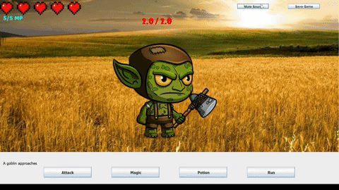
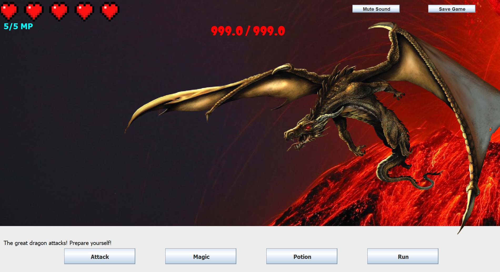
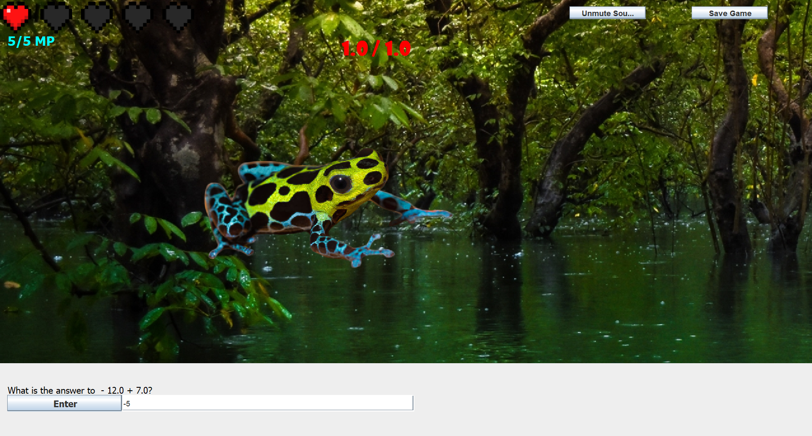

# Mental-Math-Game
A turn-based game where you need to answer math questions to attack the enemy made using Java. ([Demo Video](https://youtu.be/xOqi7ggbNU8))

By [Ethan Saunders](https://github.com/esaundere) 
Course: COMP 2800   
Date: April 7th, 2024

  

## Table of Contents
[1. Intro](#Intro)  
[2. Gameplay](#Gameplay)  
[3. Environment Setup](#Environment-Setup)  
[4. How to Play](#How-to-Play)  
[5. Results](#Results)  
[6. Next Steps](#Next-Steps)  
[7. Development Changelog](#Development-Changelog)

## Intro

I made this prototype game with the goal to make an enjoyable way to practice mental math for kids. The game has basic turn based gameplay but to properly attack, the user must answer a math question in a set amount of time. Various difficulties were implemented to ensure people of different skill levels can enjoy the game. There is also a combo system to reward accuaracy.

This game was made using Java. It utilizes basic object-oriented programming and a variety of other techniques.

## Gameplay

Check out the demo video for this project [here](https://youtu.be/zSeruhJnfVg)!

  

## Environment Setup

To successfully run this project, please follow these steps to set up your environment:

1. Any IDE that runs Java (I recommend  [VS Code](https://code.visualstudio.com/download))
2. Java SE 8 (which includes JDK 1.8.0_333) ([Download from Oracle](https://www.oracle.com/java/technologies/javase/javase8u211-later-archive-downloads.html))
3. Ensure your IDE is configured to use the above version of Java SE and JDK

The program can be run from the command line in the directory with all the assets with the commands:

javac mentalMathGame.java Music.java

java mentalMathGame

It can also be compiled directly by your IDE 
## How to Play

Simply click on the buttons and enter data into the text boxes to play.

You can save your data at any time and if you want, you can edit your save data in the file Save.txt.

## Results

This project turned out fairly well for a simple prototype but still has many features that need to be added in the future.

I learned how to utilize a variety of different Java classes and developed my problem solving and troubleshooting skills through the development process and would like to further develop my understanding as I improve the project in the future.

## Next Steps
Some potential improvements that I can see myself making in the future:

- An expanded shop that allows a player to upgrade their damage and defense
- An improved health bar to allow for more flexibility when programming encounters
- Improved animations as the current animations are not good (simply shifting images)
- Add a player character to the screen and possibly even add other party members to allow for harder fights and more diverse attacks
- Add special enemy attacks and a guard ability to make combat more complex
- Allow the player to move around a map instead of following the on-the-rails combat encounter, transitioning into a proper turn-based rpg
- Develop my own assets so they game can actually be distributed without causing copyright problems
These changes are significant but they will definitely improve the game by a large amount.

## Development Changelog
March 14th, 2024: Project outline finalized and plans drafted roughly.

March 15th, 2024: Developed plan to implement core functionality.

March 17th, 2024: Implemented 4 buttons and the textbox that will be used for all of the game's interactive elements.

March 18th, 2024: Developed the gameplay loop strucure that loops through several arrays that provide the strings and data required for each encounter.

March 19th, 2024: Created the math question generator function and tested it to ensure the answers to the output questions are correct.

March 21st, 2024: Added health and mp values and added a game reset when a game over occurs. Tested gameplay loop to ensure it functions as intended.

March 22nd, 2024: Added the ability to add shops to the game and the ability to collect and spend gold to buy potions.

March 23rd, 2024: Collected images for the enemies, background, and health bar.

March 24th, 2024: Images and enemy data are stored in arrays and I ensure images are displaying properly in the program.

March 26th, 2024: Health bar is added using hearts and I start development on the Music class.

March 27th, 2024: Music class is completed and a music array is created to store the file names of the .wav files.

March 28th, 2024: A timer is implemented to add some very basic animation (should be changed to use Graphics repaint in future)

March 29th, 2024: Enemy images are changed to move up and down now. Attack animations are added as well.

April 1st, 2024: Major bugs are resolved and testing begins.

April 7th, 2024: Project finished and submitted.# Mental-Math-Turn-Based-Game
